# 一、Why NoSQL？

​	大数据环境下现有关系型数据库已无法解决相关数据处理问题，NoSQL可以很好的解决大数据相关问题。

## 关系型数据库

​	二维表，很直观。

优点：

1. 容易理解
2. 使用方便
3. 易于维护

价值：

1. 获取持久化数据，可持久储存大量数据
2. 并发，拥有事务的支持，对于出错处理有事务回滚机制，用户并发访问有表级锁与行级锁机制支持高并发。
3. 集成，将多个相关表集成在一个数据库中，应用间可以共享数据。
4. 近乎标准的模型

## NoSQL 应用场景

1. 解决传统关系型数据库无法解决的数据存储及访问速度
2. 大数据应用问题
3. 解决互联网上应用

应对数据与流量的增加：

1. 纵向扩展，对本机进行升级，或替换新的更好的设备，成本高，且有上升天花板。
2. 横向扩展，多台机器组成集群，灵活，若某台出故障，其余机器仍可使用。

## NoSQL优势

1. 易扩展，数据之间无关系，在架构层面上带来了可扩展能力。
2. 灵活，无需事先建立要存储的数据字段，可随时存储任意自定义数据。
3. 高可用
4. 大数据量，高性能，得益于其数据之间的无关性。
5. 开源
6. 集群中运行良好。

## 定义

​	主体符合非关系型、分布式、开放源码和具有横向扩展能力的下一代数据库。

数据库分类：

1. TRDB 传统关系型数据库
2. NoSQL
3. NewSQL  


## 详细介绍三类数据库

### 1. TRDB

​	基于单机集中管理，收到该机物理性能限制，建立在DBMS上，一般情况下很难横向扩展


### 2. NoSQL

​	从数据存储结果分类：


### 3. NewSQL

​	结合TRDB与NoSQL技术上的优点，实现在大数据环境下的数据存储与处理。

# 二、TRDB与NoSQL技术比较

​	最主要核心问题，是需要解决大数据下的速度和存储问题。

纵向扩充：基于服务器本身的功能挖掘

横向扩充：基于多服务器

## 1.实现技术比较

1. 数据库数据存储模式不一样，TRDB为强数据存储模式，NoSQL为弱数据存储模式；
2. 分布式技术是NoSQL的核心技术思路，而TRDB以集中部署一台物理机为最初出发点；
3. TRDB的事务严格遵循ACID原则，而NoSQL遵循Base原则或者根本没有；
4. TRDB都遵循SQL操作标准，NoSQL没有统一的操作标准；
5. TRDB基于单机的硬盘数据处理技术为主，NoSQL基于分布式的或者内存数据处理技术为主；

## 2.引入分布式技术架构


帽子定理：

1. 一致性，指的是同一时刻，任何一个终端客户在每个节点都能读到最新写入的数据；核心要求至少两台服务器保存着一样的数据，一致性从客户角度是针对“读”。简单理解为同步数据复制功能。
2. 可用性，指的是一个运行的节点在合理的时间内总能相应更新请求，不会发生错误或超时；可用性从客户角度是针对“更新”。简单理解为满足随时更新操作功能。
3. 分区容错性，指的是当 网络发生故障时，系统仍能继续保持相应客户读请求的能力。可以简单理解为满足随时读有效数据功能。

ACID：

1. 原子性，一个事务是不可分割单位，事务中的操作要么都做要么都不做
2. 一致性，事务必须使数据库从一个一致性状态变到另一个一致性状态。数据表中的数据修改要么是所有操作一次性修改，要么根本不动
3. 隔离性，一个事务的执行不能被其他事务干扰，并发时一个客户端使用事务操作一个数据时，另一个客户端不可以对该数据进行操作，若操作则会等到事务完成时才会操作
4. 持久性，事务一旦提交，它对数据库中数据的改变是永久性的，接下来的其他操作或故障不应该对其有任何影响。事务提交后则不会再回滚（回滚无效）

BASE：

1. 基本可用，NoSQL允许分布式系统中某些部分出现故障时，系统的其余部分仍然可以继续运作。ACID则要求系统出现故障，强制拒绝。
2. 软状态，NoSQL在处理数据过程中，允许这个过程，存在数据状态暂时的不一致的情况。但经过纠错处理，最终会一致的。
3. 最终一致性，NoSQL的 软状态允许数据处理过程状态的暂时不一致，但是最终结果将是一致的。

# 三、NoSQL数据存储模式

​	**键值存储模式、文档存储模式、列族存储模式、图存储模式、其他**

## 1.键值数据库

•**是一类轻量级结合内存处理为主的NoSQL数据库。**

•**轻量级**，指的是它的存储数据结构特别简单，数据库系统本身规模也比较小；说它以内存为主的运行处理，设计目的是为了更快地实现对大数据的处理。

•**也出现了以SSD**为主的新型的键值数据库。

结构基本要素

1. 键，唯一索引
2. 值，键对应的信息
3. 键值对，键与值的组合
4. 命名空间，
5. 桶

键值存储设计优点：

 	简单，快速，高效

缺点：

​	多值查找功能弱，缺少约束，不易建立复杂关系

## 2.文档数据存储模式

•**文档数据库与传统关系数据库一样，主流的也是建立在对磁盘的读写的基础上，对数据进行各种操作。**

•**文档数据库的设计思路是针对传统数据库低效的操作性能，首先考虑的是读写性能，为此需要去掉各种传统数据库规则的约束。**

实现原理：

​	JSON格式的，一条文档记录里面含有若干条键值类型，例：

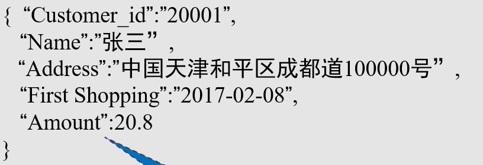

基本要素：

1. 键值对，可分为基本键值对，带结构键值对，多形结构键值对
2. 文档，由键值对组成的有序集
3. 集合，若干条文档组成
4. 数据库，包含若干集合，对数据操作时需指定数据库名

CRUD：

1. 写，DB.Books.insert({“BookID”:”100005”,”Name”:”《C语言》”,”Price”:”60”})
2. 查，DB.Books.find({“Name”:”《C语言》”})
3. 改，DB.Books.update({“Book_ID”:”100002”},{$set{“Price”:78}})
4. 删，DB.Books.remove({“Book_ID”:”100004”})

优点：

  **①简单  没有数据存储结构定义要求**

  **②相对高效**   

  **③文档格式处理**

  **④查询功能强大**

  **⑤分布式处理**

缺点：

  ①**缺少约束**

  ②**数据出现冗余**

  ③**相对低效**

## 3.列族数据存储模式

​	•**列族数据库为了解决大数据存储问题，引入了分布式处理技术，为了提高数据操作效率，针对传统数据库的弱点，采用了去规则去约束化的思路。**

​	以列为单位进行读写，查询某关键字不会将其一行都查出来，故磁盘寻道速度快，读取量较少。

确定值的顺序：命名空间->行键->列族名->列->时间戳（列值允许存在多个版本，用时间戳区分）

结构基本要素：

1. 命名空间，相当于表
2. 行键
3. 列族
4. 列

基本操作：

1. 创建create cal1，cal2，cal3.。。
2. 插入put
3. 查询get

特点：

（**1）擅长大数据处理**

**（2）对于命名空间、行键、列族需要预先定义，列无须提早定义，随时可以增加。**

**（3）在大数据应用环境下，管理复杂，必须借助各种高效的管理工具来监控系统的正常运行。**

**（4）Hadoop生态系统为基于列族的大数据分析，提供了各种开发工具。**

**（5）数据存储模式相对键值数据库、文档数据库要复杂。**

**（6）查询功能相对更加丰富**

**（7）高密集写入处理能力  每秒几百万次的并发插入能力。**

## 4.图数据存储模式

​	节点与边构成

​	可进行图的交并集，遍历等功能


# 四、 MongoDB

​	文档数据库

特点：

1. **面向集合存储：**易存储对象类型的数据，包括文档内嵌对象及数组
2. **模式自由：**无需知道存储数据的任何结构定义，支持动态查询、完全索引，可轻易查询文档中内嵌的对象和数组
3. **文档型：**存储在集合中的文档，被存储为键-值对的形式。键用于唯一标识一个文档，为字符串类型；值则可是各种复杂的文件类型
4. **高效的数据存储：**支持二进制数据及大型对象
5. **自动分片：**以支持云级别的伸缩性，支持水平的数据库集群，可动态添加额外的服务器
6. **多个存储引擎的支持：**基于硬盘读写的存储引擎(**WiredTiger**)和基于内存的存储引擎(In-Memory）

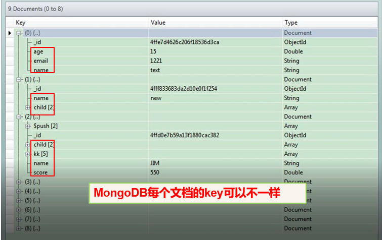

命名规则：

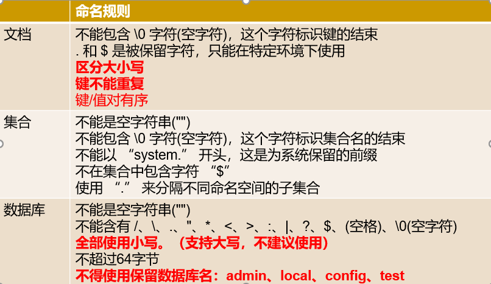

以二进制JSON形式存储=BSON

支持数据类型：

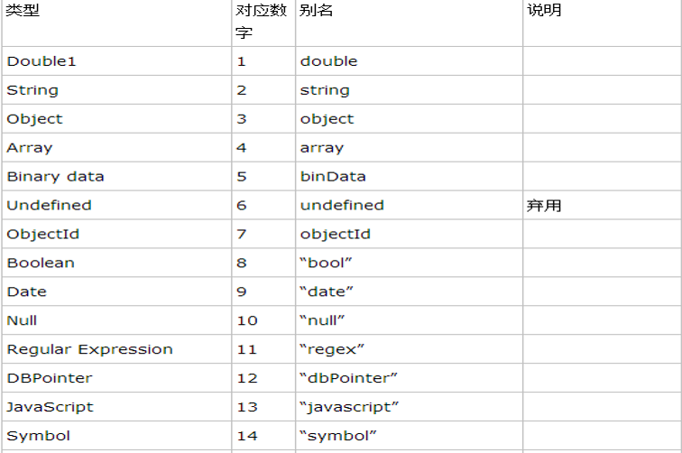

数据范式化：

1. 找出这样的对象属性，属性成为子对象，应作为一个独立的文档存储在对象文档中的不同集合中。
2. 通过组织文档和集合以最大限度减少冗余和依赖。

# 五、JSON与BSON

1. 数据结构，JSON是像字符串一样存储的，BSON是按结构存储的（像数组 或者说struct）
2. 存储空间，BSON > JSON
3. 操作速度，BSON > JSON。比如，遍历查找：JSON需要扫字符串，而BSON可以直接定位。
4. 修改，JSON要大动大移， BSON就不需要。

# 六、基本操作

查看当前数据库下集合名称：qshow collections 

​												qdb.getCollectionNames()

删除指定数据库中的集合：qdb.Collection_name.drop()

给指定数据库添加集合并添加文档：db.Collection_name.insert({key:”value”})

查询指定集合中的文档：db.collection_name.find() //返回所有文档

​											db.collection_name.findOne() //返回第一条文档

更新文档：

删除文档：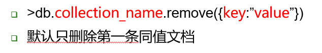

查看帮助：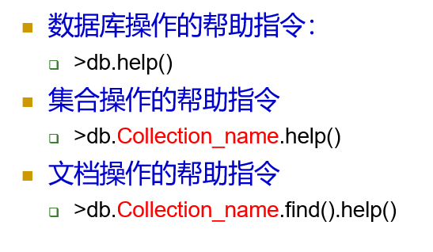

执行js代码：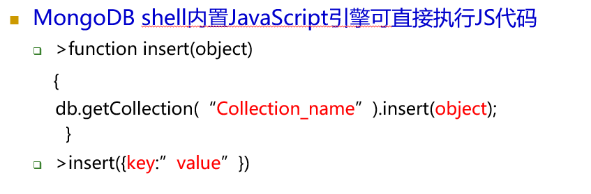


条件查询：

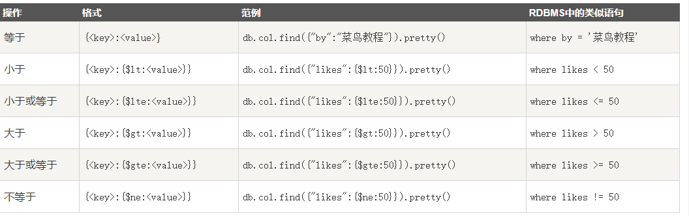

and连接：

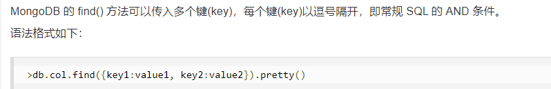

OR 条件：

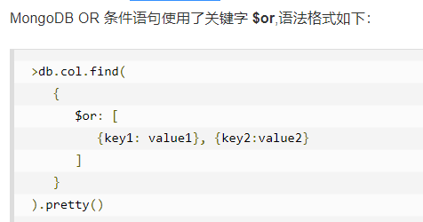

排序：

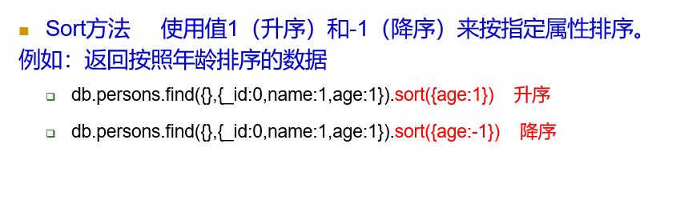

# 七、java中使用

```java
import com.mongodb.MongoClient;
import com.mongodb.client.FindIterable;
import com.mongodb.client.MongoCollection;
import com.mongodb.client.MongoCursor;
import com.mongodb.client.MongoDatabase;
import org.bson.Document;

import javax.print.Doc;
import java.util.ArrayList;
import java.util.List;

public class Main {

    public static void main(String[] args) {

        /*
        * 连接MongoDB;
        * */
        MongoClient mc=new MongoClient("localhost",27017);
        for(String name:mc.listDatabaseNames())
            System.out.println("dbName: "+name);

        /*
        * 获取指定数据库;
        * */
        MongoDatabase db=mc.getDatabase("admin");
        for(String name:db.listCollectionNames())
            System.out.println("Collections: "+name);

        /*
        * 通过集合名称从db中获取集合;
        * */
        MongoCollection<Document> collection=db.getCollection("test");

        /*
        * 向集合中添加文档
        * */
        /*Document document1=new Document("name","z3").append("age",18);
        Document document2=new Document("name","l4").append("age",19);
        List<Document> documents=new ArrayList<Document>();
        documents.add(document1);
        documents.add(document2);
        collection.insertMany(documents);*/

        
        /*
        * 遍历某集合中的所有文档
        * 以bson的格式
        * */
        FindIterable<Document> it=collection.find();
        MongoCursor<Document> mongoCursor=it.iterator();
        while(mongoCursor.hasNext())
            System.out.println(mongoCursor.next());
    }
}

```

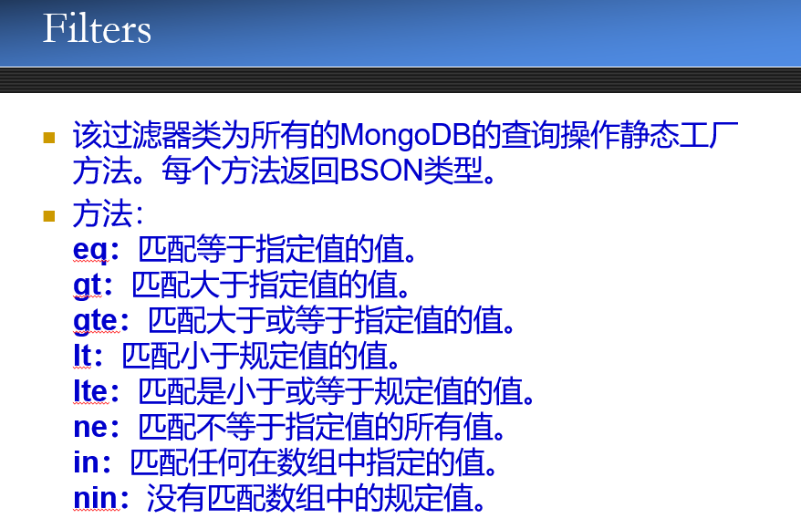

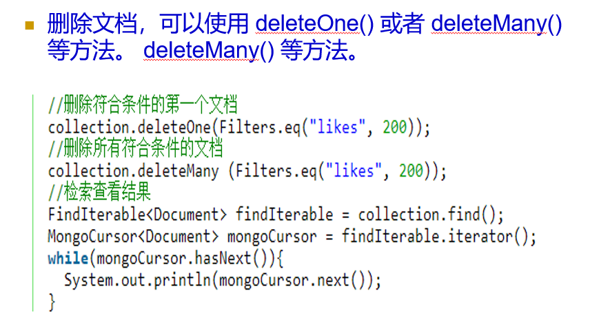