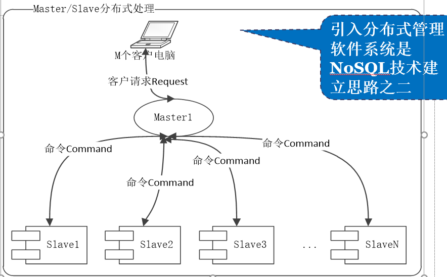

# 一、Why NoSQL？

​	大数据环境下现有关系型数据库已无法解决相关数据处理问题，NoSQL可以很好的解决大数据相关问题。

## 关系型数据库

​	二维表，很直观。

优点：

1. 容易理解
2. 使用方便
3. 易于维护

价值：

1. 获取持久化数据，可持久储存大量数据
2. 并发，拥有事务的支持，对于出错处理有事务回滚机制，用户并发访问有表级锁与行级锁机制支持高并发。
3. 集成，将多个相关表集成在一个数据库中，应用间可以共享数据。
4. 近乎标准的模型

## NoSQL 应用场景

1. 解决传统关系型数据库无法解决的数据存储及访问速度
2. 大数据应用问题
3. 解决互联网上应用

应对数据与流量的增加：

1. 纵向扩展，对本机进行升级，或替换新的更好的设备，成本高，且有上升天花板。
2. 横向扩展，多台机器组成集群，灵活，若某台出故障，其余机器仍可使用。

## NoSQL优势

1. 易扩展，数据之间无关系，在架构层面上带来了可扩展能力。
2. 灵活，无需事先建立要存储的数据字段，可随时存储任意自定义数据。
3. 高可用
4. 大数据量，高性能，得益于其数据之间的无关性。
5. 开源
6. 集群中运行良好。

## 定义

​	主体符合非关系型、分布式、开放源码和具有横向扩展能力的下一代数据库。

数据库分类：

1. TRDB 传统关系型数据库
2. NoSQL
3. NewSQL  

## 详细介绍三类数据库

### 1. TRDB

​	基于单机集中管理，收到该机物理性能限制，建立在DBMS上，一般情况下很难横向扩展

### 2. NoSQL

​	从数据存储结果分类：

### 3. NewSQL

​	结合TRDB与NoSQL技术上的优点，实现在大数据环境下的数据存储与处理。

# 二、TRDB与NoSQL技术比较

​	最主要核心问题，是需要解决大数据下的速度和存储问题。

纵向扩充：基于服务器本身的功能挖掘

横向扩充：基于多服务器

## 1.实现技术比较

1. 数据库数据存储模式不一样，TRDB为强数据存储模式，NoSQL为弱数据存储模式；
2. 分布式技术是NoSQL的核心技术思路，而TRDB以集中部署一台物理机为最初出发点；
3. TRDB的事务严格遵循ACID原则，而NoSQL遵循Base原则或者根本没有；
4. TRDB都遵循SQL操作标准，NoSQL没有统一的操作标准；
5. TRDB基于单机的硬盘数据处理技术为主，NoSQL基于分布式的或者内存数据处理技术为主；

## 2.引入分布式技术架构

帽子定理：

1. 一致性，指的是同一时刻，任何一个终端客户在每个节点都能读到最新写入的数据；核心要求至少两台服务器保存着一样的数据，一致性从客户角度是针对“读”。简单理解为同步数据复制功能。
2. 可用性，指的是一个运行的节点在合理的时间内总能相应更新请求，不会发生错误或超时；可用性从客户角度是针对“更新”。简单理解为满足随时更新操作功能。
3. 分区容错性，指的是当 网络发生故障时，系统仍能继续保持相应客户读请求的能力。可以简单理解为满足随时读有效数据功能。

ACID：

1. 原子性，一个事务是不可分割单位，事务中的操作要么都做要么都不做
2. 一致性，事务必须使数据库从一个一致性状态变到另一个一致性状态。数据表中的数据修改要么是所有操作一次性修改，要么根本不动
3. 隔离性，一个事务的执行不能被其他事务干扰，并发时一个客户端使用事务操作一个数据时，另一个客户端不可以对该数据进行操作，若操作则会等到事务完成时才会操作
4. 持久性，事务一旦提交，它对数据库中数据的改变是永久性的，接下来的其他操作或故障不应该对其有任何影响。事务提交后则不会再回滚（回滚无效）

BASE：

1. 基本可用，NoSQL允许分布式系统中某些部分出现故障时，系统的其余部分仍然可以继续运作。ACID则要求系统出现故障，强制拒绝。
2. 软状态，NoSQL在处理数据过程中，允许这个过程，存在数据状态暂时的不一致的情况。但经过纠错处理，最终会一致的。
3. 最终一致性，NoSQL的 软状态允许数据处理过程状态的暂时不一致，但是最终结果将是一致的。

# 三、NoSQL数据存储模式

​	**键值存储模式、文档存储模式、列族存储模式、图存储模式、其他**

## 1.键值数据库

•**是一类轻量级结合内存处理为主的NoSQL数据库。**

•**轻量级**，指的是它的存储数据结构特别简单，数据库系统本身规模也比较小；说它以内存为主的运行处理，设计目的是为了更快地实现对大数据的处理。

•**也出现了以SSD**为主的新型的键值数据库。

结构基本要素

1. 键，唯一索引
2. 值，键对应的信息
3. 键值对，键与值的组合
4. 命名空间，
5. 桶

键值存储设计优点：

 	简单，快速，高效

缺点：

​	多值查找功能弱，缺少约束，不易建立复杂关系

## 2.文档数据存储模式

•**文档数据库与传统关系数据库一样，主流的也是建立在对磁盘的读写的基础上，对数据进行各种操作。**

•**文档数据库的设计思路是针对传统数据库低效的操作性能，首先考虑的是读写性能，为此需要去掉各种传统数据库规则的约束。**