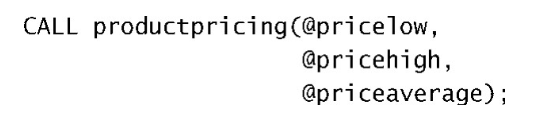

## 1SELECT

### 1.1 检索不同行

​	DISTINCT 

#### 	demo

```mysql
SELECT DISTINCT x FROM table
```

#### 	注意

​	不可部分使用distinct，若使用则会作用于所有的select指出来的列。

### 1.2 限制结果

​	LIMIT num。限制结果条数。

​	LIMIT start,num。从start行开始查询num条。从0开始编号。

​	mysql5使用替代：LIMIT num OFFSET start。

IFNULL(a,b)用于判断若a表达式值为NULL，则返回b表达式的值。

```mysql
查询第二大的工资，若不存在，则返回NULL。
SELECT IFNULL(
    (SELECT DISTINCT Salary
    FROM Employee
    ORDER BY Salary DESC
    LIMIT 1 OFFSET 1),NULL
) as SecondHighestSalary;
```


#### 	demo

```mysql
SELECT * FROM table LIMIT 5
```

### 1.3 排序数据

​	ORDER BY cal1,cal2,cal3.....。依次按照cal1，cal2进行排序。默认升序

​	DESC降序。

### 1.4 WHERE

#### 	操作符


​	BETWEEN a AND b 在[a,b]之间。 		

#### 	注意

​	若比较类型为字符串 则需要加: '实际值'。

#### 	检测空值

​	IS NULL

#### AND OR

​	AND 优先级高于OR 但可以通过加()改变复杂语句运行顺序。

#### IN (a,b)

​	也可使用嵌套select语句。

#### NOT

### 1.5 通配符过滤

#### LIKE（匹配整个串）

1. %通配符表示任何字符出现任意次数：LIKE 'jet%'则可查找以jet开头的行。通配符可以多处使用'%abc%'，%可以匹配[0,+oo]个字符。
2. _通配符匹配单个字符，必须是一个字符。

### 1.6 正则表达式（查找子串）

​	REGEXP 正则表达式不区分大小写，除非加BINARY关键字，

````mysql
例：WHERE prod_name REGEXP BINARY 'JetPack .000'
````

1. .匹配一个任意字符
2. | 相当于or
3. 匹配几个字符之一：[123]匹配1或2或3
4. [^1] 表示除了1
5. 匹配范围 [0-9]
6. 特殊字符的匹配，需要转义，加 \\\。例如查找 **'.'** ，则需要查找'\\\\.'


### 1.7 计算字段

​	即在查询时将多个列合并为一列得到新的数据段。

#### 拼接字段

​	可使用Concat(a,b,c,d) 完成拼接，可看做是字符串拼接。

```mysql
例：SELECT Concat(name,'(',age,')')
	FROM user;
```

删除数据右侧多余空格：RTrim(cal) 消除cal列的。 LTrim()左侧，Trim()两侧。

#### 执行算术运算

​	支持加减乘除。

### 1.8 函数


首先需要注意的是MySQL使用的日期格式。无论你什么时候指定一个日期，不管是插入或更新表值还是用WHERE子句进行过滤，日期必须为格式yyyy-mm-dd。


### 1.9 汇总数据

#### 聚集函数

​	对数据进行汇总，而不需要将参与的所有数据都实际检索出来，比如要获取表中的行数，而不需要将整张表展示出来。


​	注意：

1. AVG，MAX，MIN，SUM函数忽略列值为NULL的行
2. 
3. MAX，MIN函数均允许返回任意列中的最小值，不管是不是数值类型的，在对文本数据时，若文本数据按相应列排序，则最小值是最前面的行，最大值是最后面的。
4. 所有函数均可结合WHERE子句使用。

#### 聚集不同值

​	


#### 组合聚集函数

​	多个聚集函数同时使用


### 1.10 分组数据

#### 创建分组

​	GROUP BY


#### 过滤分组

​	HAVING过滤分组，WHERE过滤行


​	排序：order by


### 1.11 子查询

​	in() 当然也可用于测试等于（=），不等于（<>）等。


#### 作为计算字段使用子查询

​	

### 1.12 联结表

​	外键  表中某一列是另一个表的主键。

​	维护引用完整性： 对于外键必须**插入该外键所在表中已存在的主键**。

#### 等值联结（内部联结）

​	where  a.id=b.id

​	笛卡尔积  由没有联结条件的表关系返回的结果为笛卡尔积 检索行数为两表行数之积。

​	 a   INNER JOINN   b     ON a.id-b.id;


多表联结：AND 连接即可。


注意：联结表越多，性能下降越厉害。

### 1.13 高级联结

#### 自联结

​	在单条select语句中不止一次引用相同的表

子查询：


自联结：

对一张表起两次别名，消除二义性，让mysql可以区分出所指表。


#### 自然联结

​	应用场景：某个列不止出现在一个表中，自然联结可以消除重复列。

​	使用通配符，对其他表的列使用明确子集完成。

​	

#### 外部联结

​	将一个表中的行与另一个表关联，但是同时需要将没有关联到的行也显示出来。


​	OUTER JOIN 结合左右联结使用。

​	

​	left则会显示所有左边的行，right则是右边表。

#### 带聚集函数的联结

​	使用自然联结，外部联结均可。

#### 使用联结的条件

​	

### 1.14 组合查询

​	UNION将多个SELECT语句组合成一个结果集。

​	在多个SELECT语句中间使用UNION连接即可，例：


#### 注意点

1. UNION须由两条及以上SELECT语句组成
2. 每个查询必须包含相同列，表达式或聚集函数（顺序可不一致，但查询内容须一致）
3. 列数据类型必须兼容
4. **UNION自带去重**，若不带去重则将关键字改为UNION ALL即可。
5. 对数据进行排序，ORDER BY需要出现在最后一条SELECT中。

### 1.15 全文本搜索

​	两个最常使用的引擎为MyISAM和InnoDB，前者支持全文本搜索，而后者不支持。

​	5.6.24版本后innoDB也支持了。

#### 使用LIKE或正则表达式的限制

1. 两者都是在整个表中通过匹配所有行进行检索，故效率随表规模增大而下降
2. 明确控制，很难明确控制匹配什么与不匹配什么
3. 一个特殊词的搜索将会返回包含该词的所有行，而不区分包含单个匹配的行和包含多个匹配的行（按照可能是更好的匹配来排列它们）。类似，一个特殊词的搜索将不会找出不包含该词但包含其他相关词的行。


#### 添加索引

​	在建表时，使用FULLTEXT（a,b,c）子句，例：


​	在定义之后，MySQL自动维护该索引。在增加、更新或删除行时，索引随之自动更新。

​	可以在创建表时指定FULLTEXT，或者在稍后指定（在这种情况下所有已有数据必须立即索引）。

#### 全文本 搜索

​	使用Match()和Against()函数，Match函数指定被搜索列，Against指定使用的搜索表达式。


​	使用完整的**Match函数**，传递值必须与FULLTEXT定义相同，若指定了多个列，则需全部列出，且次序正确。

​	全文本搜索默认不区分大小写，使用BINARY区分。

​	全文本搜索对结果排序，具有较高等级的行先返回。

#### 扩展查询

​	


#### 布尔文本搜索

1. 要匹配的词
2. 要排斥的词
3. 排列提示
4. 表达式分组
5. 其余
6. 即使没有FULLTEXT索引也可以使用，但很慢


​	若不限定操作符，则包含两单词任一的即可被搜索到。

#### 总结

1. 在索引全文本数据时，短词被忽略且从索引中排除。短词定义为那些具有3个或3个以下字符的词（如果需要，这个数目可以更改）。
2. MySQL带有一个内建的非用词（stopword）列表，这些词在索引全文本数据时总是被忽略。如果需要，可以覆盖这个列表（请参阅MySQL文档以了解如何完成此工作）。
3. 许多词出现的频率很高，搜索它们没有用处（返回太多的结果）。因此，MySQL规定了一条50%规则，如果一个词出现在50%以上的行中，则将它作为一个非用词忽略。50%规则不用于IN BOOLEANMODE。
4. 如果表中的行数少于3行，则全文本搜索不返回结果（因为每个词或者不出现，或者至少出现在50%的行中）。
5. 忽略词中的单引号。例如，don't索引为dont。
6. 不具有词分隔符（包括日语和汉语）的语言不能恰当地返回全文本搜索结果。

## 2 INSERT

​	降低语句优先级：

### 2.1 插入多行数据

​	

​	单条插入语句插入多条数据的效率比多条INSERT语句高。

### 2.2 将检索数据插入表中

​	应用场景：数据迁移。例：将custnew表中数据插入customers中（注意自增主键使用新表自身，SELECT查出来的信息按**你列出来的列顺序**填到新表的对应列上）。

​	

​	select语句也可以包含where等过滤条件。

## 3 UPDATA DELETE

### upd

​	updata table  SET col = val WHERE id = x;若不指定where语句则更新全表。

​	更新多列则添加逗号即可。

​	语句中可以使用子查询。

​	**IGNORE 关键字**，若upd语句更新多行，更新某行时出错，也继续。UPDATA IGORE table即可。

### del

​	删除整行。

​	删表更快的方式：TRUNCATE TABLE，删掉原来的表，建一个新表。

## 4 CREATE

​	处理现有表，在创建表时若已存在，若任要建表，则需手动删除已有表，再建表，**而不是直接覆盖**。

​	若仅想在一个表不存在时创建他，则应在表名后跟IF NOTEXISTS。这样做不检查已有表的模式是否与你打算创建的表模式相匹配。它只是查看表名是否存在，并且仅在表名不存在时创建它。

​	DEFAULT 默认值

​	PRIMARY KEY 主键

### 引擎类型

​	**外键不能跨引擎**。

​	SHOW ENGINES可查看所有支持引擎。

#### MyISAM与InnoDB的区别

1. 存储结构，每个MyISAM在磁盘上存储成三个文件。InnoDB所有表都存在同一个数据文件中。
2. 存储空间，MyISAM可被压缩，存储空间较小，支持静态，动态，压缩表；InnoDB需要更多的内存和存储，它会在主内存中建立其专用的缓冲池用于高速缓冲数据和索引。
3. 可移植性、备份及恢复，MyISAM数据以文件存储，跨平台转移方便，备份恢复可单独对某个表操作；
4. 事务支持，InnoDB支持事务。
5. AUTO_INCREMENT。
6. 表锁，MyISAM表锁；InnoDB支持事务与行级锁，若非主键的where则会锁全表。
7. 全文索引，都支持。
8. 表主键，均允许无索引与主键，但InnoDB无主键时会自动生成一个主键。
9. 表行数，MyISAM保存有行数，InnoDB计算行数需遍历所有行。
10. CRUD，MyISAM执行大量SELECT语句；InnoDB执行大量增改操作。
11. 外键，InnoDB支持。

### 更新表

​	ALTER TABLE语句。

1. 添加列 ALTER TABLE table ADD 列。
2. 删除列 DROP COLUMN col；
3. 一般修改表前建议备份。需要建新表，将数据复制，在此基础上进行操作。

### 删除表

​	DROP TABLE table  **永久删除表。**

### 重命名

​	RENAME TABLE table col1 TO col2；

## 5 视图

### 5.1 规则

1. 视图名唯一
2. 视图数目无限制
3. 创建视图须有足够的访问权限
4. 视图可以嵌套
5. 视图不能索引
6. 视图可与表一起使用，联结表与视图。

### 5.2 创建

​	CREATE VIEW创建

​	SHOW CREATE VIEW viewname;查看创建视图

​	DROP VIEW view删除

​	CREATE OR REPLACE VIEW更新

### 5.3 简化复杂联结


```mysql
SELECT cust_name
FROM productcustomers
WHERE customers.cust_id=1;
```

### 5.4 格式化检索出的数据

​	比如要格式化一个数据，将name，city以一定格式输出，要用Concat函数做一些格式化，这时可以将这个格式化数据包装成一个视图，就可以直接SELECT *这个视图了，例：

​	1.将格式化数据包装成视图

​	

​	2.就可以直接查视图了


### 5.5 过滤不想要的数据

​	过滤掉无邮件地址的客户：


### 5.6 使用视图与计算字段

​	一样的，包装成视图就行。

### 视图更新

​	视图不存储数据，只是一种中间工具，所以修改视图数据，实际上是对原表进行修改，所以对视图修改没有意义。

​	若视图中使用了 分组、联结、子查询、并、聚集函数、DISTINCT、计算列则不可更新。

## 6 使用存储过程

​	保存一条或多条MySQL语句集合，可简单视作批文件。

​	简便，安全，高性能

### 注意

​	MySQL默认使用**';'**作为一条语句的结束，而存储过程类似函数，故在创建存储过程时若多条语句会发生书写某条语句后便结束书写，那肯定是不对的。

​	所以这里需要先将MySQL语句结束符进行修改，书写完毕后再修改回来，例：


​	先使用DELIMITER 将结束标记修改，写完存储过程后，再修改回来即可。

​	存储过程可以传递参数，类比函数的形参。

​	使用：CALL abc();若有参数，则括号内书写参数。

### 删除

​	DROP PROCEDURE abc；不需要写括号，只写名称

### 变量

​	输入变量需用IN修饰，返回变量需用OUT修饰：

​	

​	使用变量需用加@标识：



​	存储过程本身不输出结果，而是将结果存储在变量中，之后需再书写SELECT语句查询变量：


​	一个有in，也有out的例子：


​	使用：

### 复杂情景


​	可以添加注释--

​	上述场景为：自己定义两个变量，一个是临时存储最终金额的浮点数total，一个表示利率的taxrate。

1. 首先查询合计金额
2. 若需要税收，则会通过if语句
3. 最后将临时变量的值存储到返回变量中

if ，elseif需要跟then，else不需要

### 检查存储过程

​	

​	显示创建一个存储过程的语句

​	若要显示何时，创建者，需要使用SHOW PROCEDURE STATUS会列出所有存储过程

​	限制输出，可使用LIKE 关键字指定过滤。

## 7 游标（MySQL5以后）

​	暂时跳过。

## 8 触发器（MySQL5以后）

​	用于响应upd，del，insert而自动执行的一条MySQL语句

### 创建

需要声明的信息

1. 唯一触发器名
2. 关联的表
3. 触发器该响应的活动（DELETE、INSERT或UPDATE）
4. 触发器何时执行（处理前或之后）

CREATE TRIGGER创建


注意：如果BEFORE触发器失败，则MySQL将不执行请求的操作。此外，如果BEFORE触发器或语句本身失败，MySQL将不执行AFTER触发器（如果有的话）。

### 删除

​	DROP TRIGGER x;

### insert 触发器

1. 在INSERT触发器代码中，可以引用一个名为NEW的虚拟表，访问被插入的行；
2. 在BEFORE INSERT触发器中，NEW中的值也可以被更新（允许改变被插入的值）；
3. 对于AUTO_INCREMENT列，NEW在INSERT执行之前包含0，在INSERT执行之后包含新的自动生成值。

MySQL5之后不允许触发器返回结果集，故可将结果放入变量中：

```mysql
CREATE TRIGGER hello AFTER INSERT ON class
FOR EACH ROW SELECT NEW.c_id INTO @ee;
```

​	插入后将该次插入时生成的AUTO_INCREMENT的值放入ee变量中。

​	然后就可以在ee获取到该值了：

​	


通常before用于数据验证与净化，比如可以将某个字段大写：

```mysql
CREATE TRIGGER helllo BEFORE INSERT ON class
FOR EACH ROW SET NEW.c_name=Upper(NEW.c_name);

insert into class(c_name,teacher_id) values('asdf',2);
```

这样做保证插入数据之后，name字段是大写的。

### delete 触发器

1. 触发器代码内部可以引用OLD虚拟表，访问删除的行。
2. OLD内值只读。

比如可以使用一个before触发器，将要删除的行从OLD表备份一份到其他表中：


​	若由于某种原因，订单不能存档，DELECT本身将被放弃。

### upd 触发器

1. OLD访问旧信息，NEW访问新信息
2. NEW，OLD中关于值的访问与之前一致

例：将名字在插入前改为大写：

```mysql
CREATE TRIGGER upd BEFORE UPDATE ON class
FOR EACH ROW SET NEW.c_name=Upper(New.c_name);

update class SET c_name='hello' where c_id=2;
```


## 9 事务处理

​	InnoDB支持事务处理。

​	事务处理用来维护数据库的完整性，它保证成批的MySQL要么全部执行，要么全部不执行。

​	使用 START TRANSACTION 开启事务。

​	使用 ROLLBACK回退事务，但无法撤销CREATE与DROP。

​	使用COMMIT提交事务。

### 支持部分回退（使用保留点）

​	使用SAVEPOINT语句：


​	保留点在事务处理完成后自动释放。

### 修改默认的提交行为

​	SET autocommit=0；

