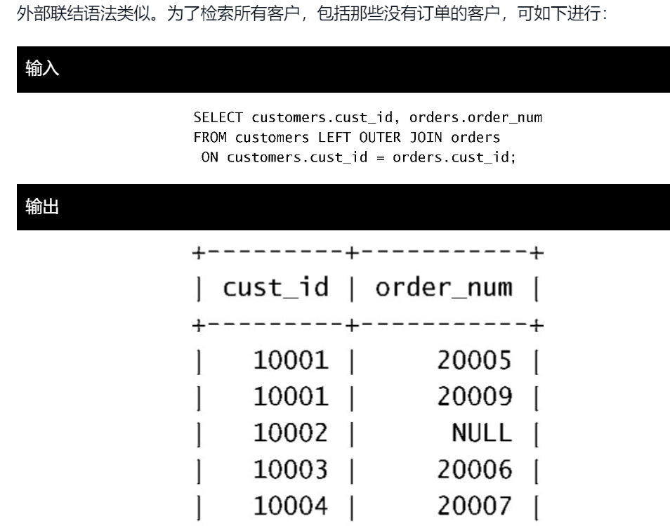

# 1.基本语句

## 1.1SELECT

### 1.1.1 检索不同行

​	DISTINCT 

#### 	demo

```mysql
SELECT DISTINCT x FROM table
```

#### 	注意

​	不可部分使用distinct，若使用则会作用于所有的select指出来的列。

### 1.1.2 限制结果

​	LIMIT num。限制结果条数。

​	LIMIT start,num。从start行开始查询num条。从0开始编号。

​	mysql5使用替代：LIMIT num OFFSET start。

IFNULL(a,b)用于判断若a表达式值为NULL，则返回b表达式的值。

```mysql
查询第二大的工资，若不存在，则返回NULL。
SELECT IFNULL(
    (SELECT DISTINCT Salary
    FROM Employee
    ORDER BY Salary DESC
    LIMIT 1 OFFSET 1),NULL
) as SecondHighestSalary;
```


#### 	demo

```mysql
SELECT * FROM table LIMIT 5
```

### 1.1.3 排序数据

​	ORDER BY cal1,cal2,cal3.....。依次按照cal1，cal2进行排序。默认升序

​	DESC降序。

### 1.1.4 WHERE

#### 	操作符


​	BETWEEN a AND b 在[a,b]之间。 		

#### 	注意

​	若比较类型为字符串 则需要加: '实际值'。

#### 	检测空值

​	IS NULL

#### AND OR

​	AND 优先级高于OR 但可以通过加()改变复杂语句运行顺序。

#### IN (a,b)

​	也可使用嵌套select语句。

#### NOT

### 1.1.5 通配符过滤

#### LIKE（匹配整个串）

1. %通配符表示任何字符出现任意次数：LIKE 'jet%'则可查找以jet开头的行。通配符可以多处使用'%abc%'，%可以匹配[0,+oo]个字符。
2. _通配符匹配单个字符，必须是一个字符。

### 1.1.6 正则表达式（查找子串）

​	REGEXP 正则表达式不区分大小写，除非加BINARY关键字，

````mysql
例：WHERE prod_name REGEXP BINARY 'JetPack .000'
````

1. .匹配一个任意字符
2. | 相当于or
3. 匹配几个字符之一：[123]匹配1或2或3
4. [^1] 表示除了1
5. 匹配范围 [0-9]
6. 特殊字符的匹配，需要转义，加 \\\。例如查找 **'.'** ，则需要查找'\\\\.'


### 1.1.7 计算字段

​	即在查询时将多个列合并为一列得到新的数据段。

#### 拼接字段

​	可使用Concat(a,b,c,d) 完成拼接，可看做是字符串拼接。

```mysql
例：SELECT Concat(name,'(',age,')')
	FROM user;
```

删除数据右侧多余空格：RTrim(cal) 消除cal列的。 LTrim()左侧，Trim()两侧。

#### 执行算术运算

​	支持加减乘除。

### 1.1.8 函数


首先需要注意的是MySQL使用的日期格式。无论你什么时候指定一个日期，不管是插入或更新表值还是用WHERE子句进行过滤，日期必须为格式yyyy-mm-dd。


### 1.1.9 汇总数据

#### 聚集函数

​	对数据进行汇总，而不需要将参与的所有数据都实际检索出来，比如要获取表中的行数，而不需要将整张表展示出来。


​	注意：

1. AVG，MAX，MIN，SUM函数忽略列值为NULL的行
2. 
3. MAX，MIN函数均允许返回任意列中的最小值，不管是不是数值类型的，在对文本数据时，若文本数据按相应列排序，则最小值是最前面的行，最大值是最后面的。
4. 所有函数均可结合WHERE子句使用。

#### 聚集不同值

​	


#### 组合聚集函数

​	多个聚集函数同时使用


### 1.1.10 分组数据

#### 创建分组

​	GROUP BY


#### 过滤分组

​	HAVING过滤分组，WHERE过滤行


​	排序：order by


### 1.1.10 子查询

​	in() 当然也可用于测试等于（=），不等于（<>）等。


#### 作为计算字段使用子查询

​	

### 1.1.11 联结表

​	外键  表中某一列是另一个表的主键。

​	维护引用完整性： 对于外键必须**插入该外键所在表中已存在的主键**。

#### 等值联结（内部联结）

​	where  a.id=b.id

​	笛卡尔积  由没有联结条件的表关系返回的结果为笛卡尔积 检索行数为两表行数之积。

​	 a   INNER JOINN   b     ON a.id-b.id;


多表联结：AND 连接即可。


注意：联结表越多，性能下降越厉害。

### 1.1.12 高级联结

#### 自联结

​	在单条select语句中不止一次引用相同的表

子查询：


自联结：

对一张表起两次别名，消除二义性，让mysql可以区分出所指表。


#### 自然联结

​	应用场景：某个列不止出现在一个表中，自然联结可以消除重复列。

​	使用通配符，对其他表的列使用明确子集完成。

​	

#### 外部联结

​	将一个表中的行与另一个表关联，但是同时需要将没有关联到的行也显示出来。


​	OUTER JOIN 结合左右联结使用。

​	

​	left则会显示所有左边的行，right则是右边表。

#### 带聚集函数的联结

​	使用自然联结，外部联结均可。

#### 使用联结的条件

​	

### 1.1.13 组合查询

​	UNION将多个SELECT语句组合成一个结果集。

