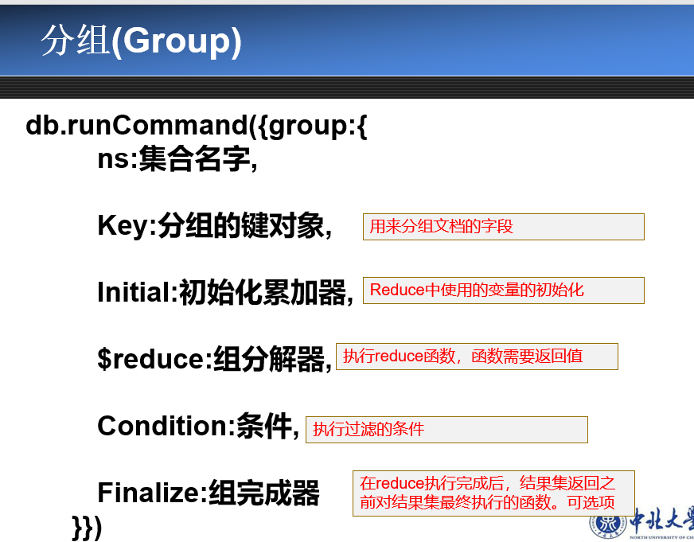

1. 帽子定理

    一致性，可用性，分区容错性

    至少两台服务器保存着一样的数据，一个运行的节点在合理时间内总能更新请求，发生网络故障时，系统仍能保持客户读写功能

2. BASE

    基本可用，软状态，最终一致性

3. NoSql四大类

    键值存储模式，列族存储模式，文档存储模式，图存储

4. mogodb主要特点

    面向集合存储，模式自由，文档型，高效的数据存储，自动分片，多存储引擎支持

5. 

6. find

7. 

8. 

9. 分组

    

    

10. 

